

 
<h2 align="center"><b>KU CSE 14</b></h2>
<h4 align="center">A photo sharing and storage service Android app developed by kucsebatch14.</h4>

 Download it from Google Drive or Github Releases 

 

 
  

<a href="#screenshots">Screenshots</a> &bull; <a href="#development">Discreptions</a> &bull;<a href="#development">Join development!</a> &bull; <a href="#component">Component</a> &bull; <a href="#feature">Features</a> &bull; <a href="#rules">Contrubution rules</a> &bull; <a href="#share">Share</a>

<a href="https://kucsebatch14.github.io">Website</a> &bull; <a href="kucsebatch14@gmail.com">Email</a>  &bull; <a href="https://github.com/kucsebatch14">GitHub</a>

 
## Screenshots
 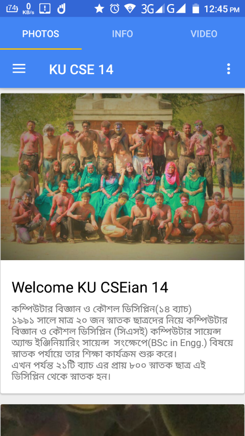 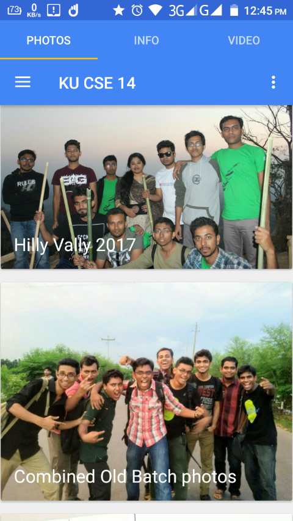 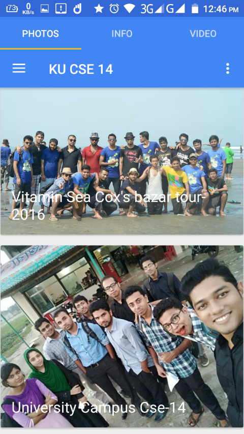 
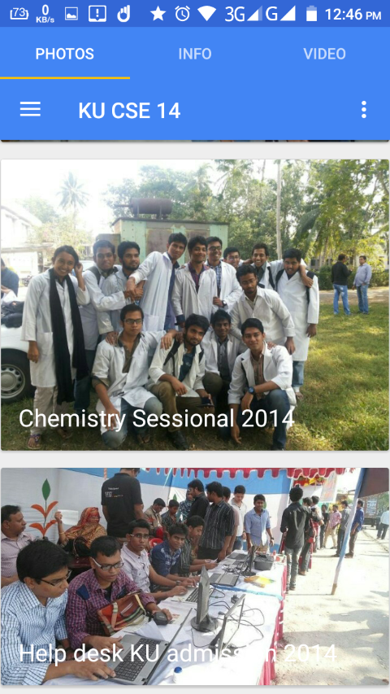  
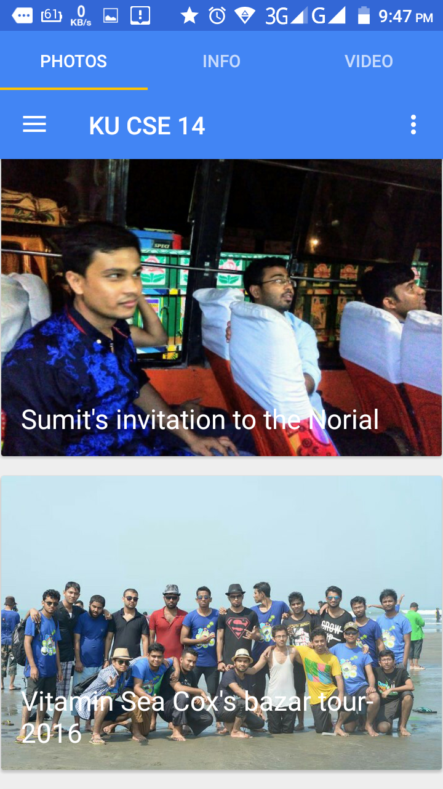 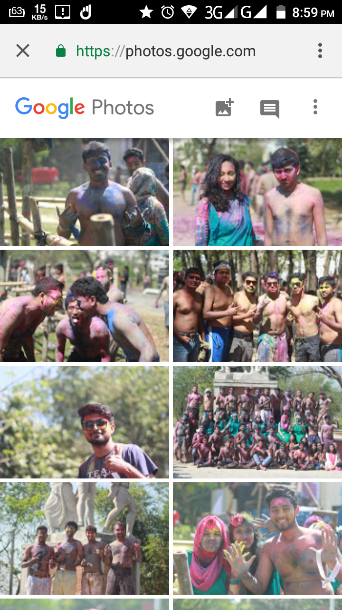 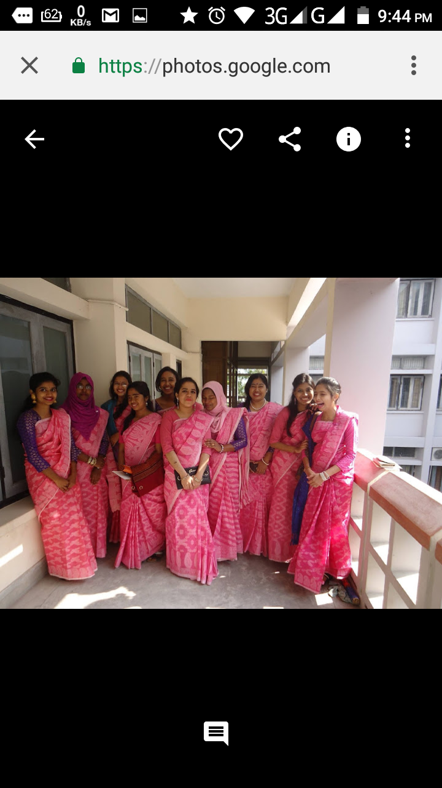
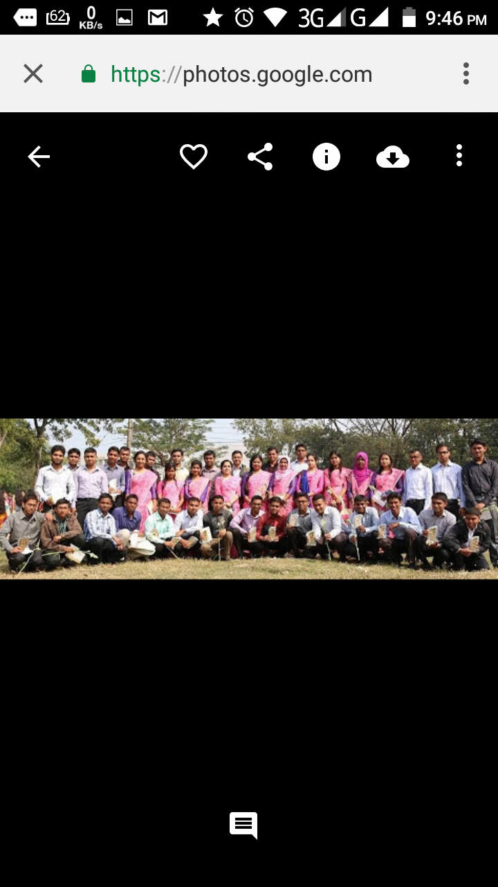  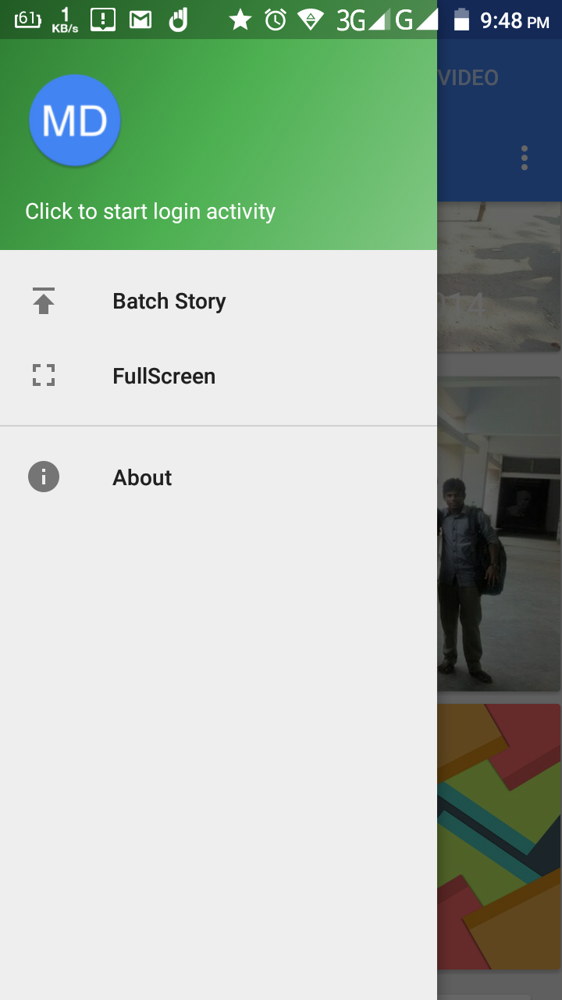
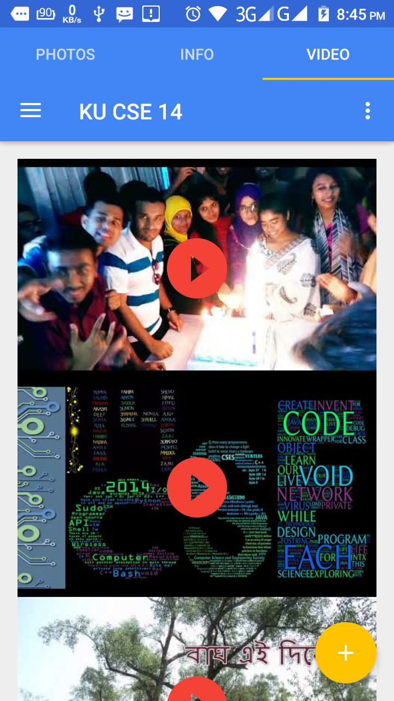  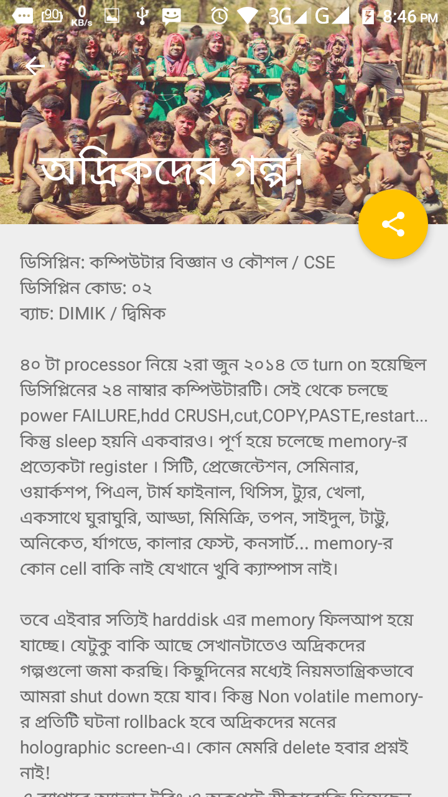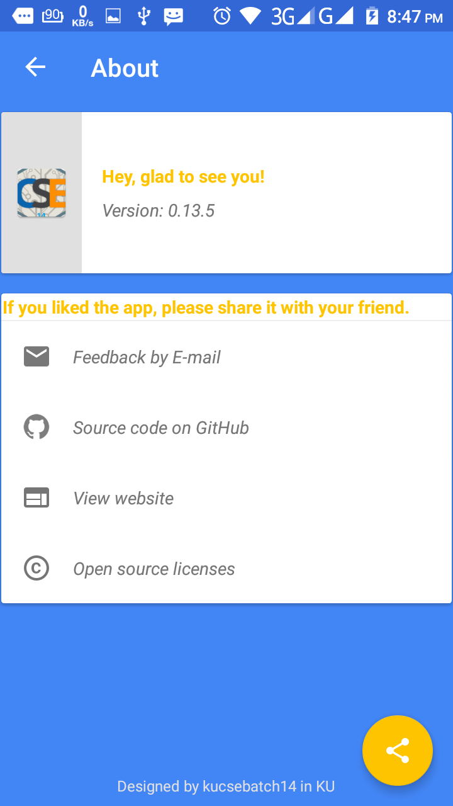

## Discreptions :

In 1991, Computer Science and Engineering (CSE) Discipline of Khulna University (KU) started its academic activities with only 20 undergraduate students. Since then, around 800 undergraduate students (of 18 batches) graduated from this Discipline. Now this app is all about to archive the 24th batch -KU CSEian14's student's all batch photo in one place.

## Development :

<!-- **Build status:** master  stable  -->

**Start contributing:** If you are a kucseian14 you can collect your old batch photo and contact to kucsebatch14@gmail.com. For programming Contrubution: Fork this repository and contribute back using pull requests to the master branch. It's open to all about giving new idea about the prject.
It's super easy to make [pull requests](https://github.com/kucsebatch14/KUCSE-batch-photo-android-app/pulls).

**License:** [GNU General Public License v3.0](https://github.com/kucsebatch14/KUCSE-batch-photo-android-app/blob/master/LICENSE)

## Features :

* Mterial Design
* HD Quality photos storage and view
* All batch student pic info
* Old photos are in action
* Smooth scrolling

## Component :

- NavigationView  
- CoordinatorLayout  
- AppBarLayout  
- CollapsingToolbarLayout  
- NestedScrollView  
- TabLayout  
- FloatingActionButton  
- SnackBar  
- SwipeRefreshLayout  
- RecyclerView  
- CardView  
- TextInputLayout  
- BottomSheetDialog  
- SharedElementTransitions  
- BottomNavigationView  
- Adaptive icon  
- App shortcuts 
  
---  

#### Contrubutor of the open source project  
- [Md. Shahidul Islam](https://github.com/shahidul56)  
# Rules
> 1. Don't do evil.
> 2. Don't repeat yourself.
> 3. Only make one change per commit 

#### :  
    Copyright 2018  kucsebatch14  
      
    The product includes:  
      
    Apache License, Version 2.0  
    You may obtain a copy of the license at  
    http://www.apache.org/licenses/LICENSE-2.0  
      
    Android Support Library  
    Copyright © 2005 The Android Open Source Project. All rights reserved. 
    http://developer.android.com/tools/extras/support-library.html  
      
    Glide  
    Copyright © 2014 Google, Inc. All rights reserved.  
    https://github.com/bumptech/glide  
      
    Google Material Design Icons  
    Copyright © Google, Inc. All rights reserved.  
    https://material.io/icons/
  
[_**- Designed by kucsebatch14 in Khulna University CSE lab.**_](https://kucsebatch14.github.io)

## Share  
> Like this project? Why not share to your friend :)  
>   
> &nbsp;&nbsp;&nbsp;&nbsp;&nbsp;&nbsp;&nbsp;&nbsp;&nbsp;&nbsp;&nbsp;&nbsp;</a>
